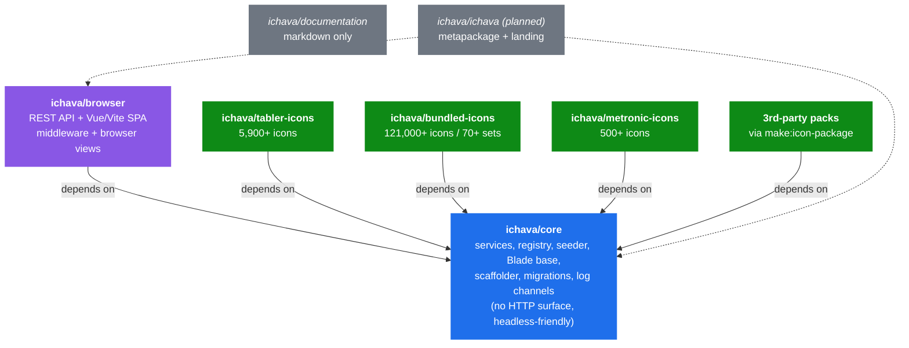
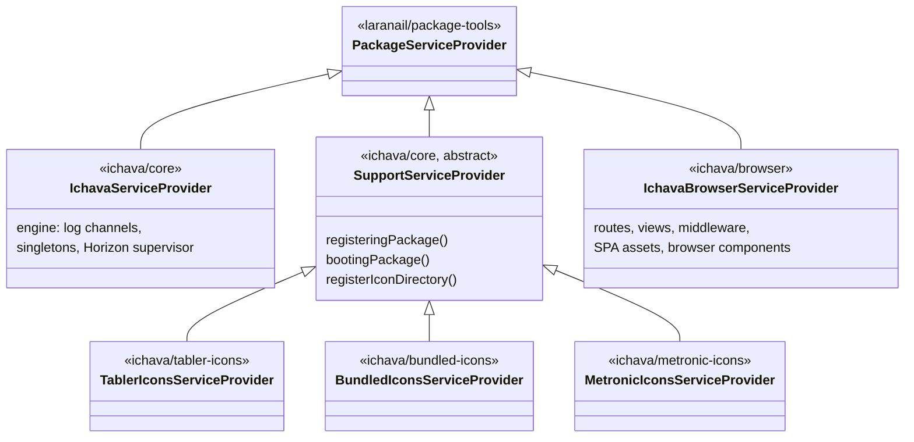

[← Documentation index](README.md)

# Architecture

*Explanation.*

Ichava is built on the [Laranail Package Tools](https://github.com/laranail/package-tools) library (a Spatie package-tools fork). The ecosystem is composed of focused, single-responsibility Composer packages that depend on each other through a clean directed graph. Install only what you need.

## Package topology



The `ichava/browser` package owns the *entire HTTP layer* (REST API, SPA, middleware). Core ships zero HTTP surface, so `composer require ichava/core` alone gives a fully functional headless icon engine. Icon packs depend only on core, so a CLI-only deployment can install `core` + a pack with no Node, Vite, or browser dependencies.

## Dependency rules

| Rule | Rationale |
|---|---|
| `ichava/core` depends only on `laranail/package-tools` and Laravel framework | Headless server installs (no JS toolchain) work cleanly. |
| `ichava/browser` depends on `ichava/core` | Browser is a UI consumer, not an icon source. |
| Icon packs depend on `ichava/core` (never on `ichava/browser`) | Decouples icon distribution from UI. Install core + a pack and have CLI / Blade access with no Vue, Vite, or Node.js. |
| `ichava/browser` does not depend on icon packs | The browser discovers them at runtime via `IconRegistry`. Install any combination. |
| Cross-package class names follow constants (`IconsServiceProvider`, `IconsConstants`, `IconComponent`, `Variant` / `Category`) | Disambiguated by namespace. No double-suffix bugs and easy ecosystem-wide grep. |

## Service-provider hierarchy



> **Rule for icon packs:** extend `Simtabi\Laranail\Ichava\Support\ServiceProvider` (lives in `ichava/core`). Never extend `IchavaServiceProvider`, `IchavaBrowserServiceProvider`, or `PackageServiceProvider` directly.

> **Rule for the browser package:** extends `laranail/package-tools`' `PackageServiceProvider` directly. Boots its routes, views, and Vite assets in `bootingPackage()` so core's services are guaranteed to be bound first.

## What `IchavaServiceProvider` registers

Core singletons, in dependency order:

| Binding | Alias | Purpose |
|---|---|---|
| `SvgProcessingService` | - | SVG processing pipeline |
| `IchavaLogger` | `ichava.logger` | Structured logging |
| `PathResolver` | - | Icon path parsing |
| `SvgDriver` | - | SVG file loading and rendering |
| `IconCacheService` | `ichava.cache` | Unified icon caching |
| `IconRegistry` | - | Package and icon-set management |
| `IconWatcherService` | - | File-change monitoring |
| `IconDiscoveryService` | - | Icon browsing and search |
| `IconPreferenceService` | - | Per-user icon preferences |
| `IchavaLifecycleManager` | - | Boot lifecycle management |
| `DeferredIconsRegistry` | - | SVG `<symbol>` sprite pool |
| `ConfigurationService` | - | Config helper (no dependents) |
| `DatabaseOperationsService` | - | Extracted from DB commands |
| `CacheOperationsService` | - | Extracted from cache commands |
| `InformationService` | - | Extracted from info commands |
| `IconsManifest` | - | Manifest generation and reading |
| `Ichava` | `ichava` | Facade backing class |
| `IconRenderer` | - | Fluent renderer (fresh per resolve) |

Artisan commands:

| Command | Sub-actions |
|---|---|
| `ichava:database` | seed, seed:icons, seed:terms, migrate, unseed, refresh, truncate, stats |
| `ichava:cache` | clear, rebuild, refresh, generate, stats |
| `ichava:info` | packages, icons, languages, discover, stats, status |
| `ichava:job-status` | - |
| `ichava:watch` | - |
| `ichava:cleanup-logs` | - |
| `make:icon-package` | - |
| `ichava:update-<pack>-icons` | - |

`InjectNpmScriptsCommand` lives in `ichava/browser`, not core.

Blade components and directives (registered by core):

| Tag | Class | Notes |
|---|---|---|
| `<x-ichava::icon />` | `IconComponent` | Generic, works with any installed pack |
| `<x-ichava::*>` | class-based namespace | Browser layouts, demo components register their own classes via `Blade::component()` |
| `@ichava_defs` | `DeferredIconsRegistry` | Renders the SVG `<defs>` pool |

Log channels (registered before any service that logs):

| Channel | File | Level env var |
|---|---|---|
| `ichava` | `storage/logs/ichava.log` | `ICHAVA_LOG_LEVEL` |
| `ichava-icons` | `storage/logs/ichava-icons.log` | `ICHAVA_SEEDING_LOG_LEVEL` |
| `ichava-queue` | `storage/logs/ichava-queue.log` | `ICHAVA_QUEUE_LOG_LEVEL` |

## What `IchavaBrowserServiceProvider` registers

Routes:

| File | Purpose |
|---|---|
| `routes/api.php` | REST endpoints (icons, packages, terms, preferences, cache) |
| `routes/web.php` | SPA + cache-management web routes |

Middleware groups:

| Group | Stack |
|---|---|
| `ichava.api` | hybrid: `web` (Sanctum) or `StartSession` (sessions only) or none, plus `ichava.guard`, `ichava.session`, `ichava.security`, `ichava.json`, `ichava.log`, `throttle:N,1` |
| `ichava.web` | `web`, `ichava.validate` |

Per-middleware aliases: `ichava.guard`, `ichava.session`, `ichava.security`, `ichava.json`, `ichava.log`, `ichava.validate`. Plus the legacy `ichava.api.security` alias.

The middleware stack uses **hybrid detection** via `HostCapabilities`. Adds the `web` middleware only when Laravel Sanctum + sessions are available; otherwise falls back to a minimal stateless stack. This means `ichava/browser` works in any Laravel application without configuration.

Browser provider also publishes:

- Browser config: `config/ichava-browser.php` (`--tag=ichava-browser-config`)
- SPA dist assets: `public/vendor/ichava/` (`--tag=ichava-assets`)
- Browser-only Blade components: `<x-ichava::layouts.app>`, `<x-ichava::layouts.browser>`, `<x-ichava::ichava-test-icons>`, `<x-ichava::ichava-ui-icons>`
- Anonymous Blade component path under the `ichava::` namespace
- Browser's bundled `ui-icons` set (registered with core's `IconRegistry`)

## Boot order

```mermaid
sequenceDiagram
    autonumber
    participant App as Laravel app
    participant Core as IchavaServiceProvider
    participant Pack as Pack provider
    participant Browser as IchavaBrowserServiceProvider

    App->>Core: register()
    Note over Core: log channels created<br/>core singletons bound<br/>Horizon supervisor configured
    App->>Pack: registeringPackage()
    Note over Pack: config merge + commands only.<br/>Core services NOT yet bound;<br/>do not touch IconRegistry or IchavaLogger.
    App->>Core: boot()
    Note over Core: Blade directives,<br/>generic &lt;x-ichava::icon&gt; component
    App->>Pack: bootingPackage()
    Pack->>Core: registerIconDirectory()
    Pack->>Core: log via IchavaLogger
    App->>Browser: bootingPackage()
    Note over Browser: routes, views, middleware,<br/>SPA assets, browser components.<br/>Core's IconRegistry is bound (composer order).
```

Common bug: logging in `registeringPackage()` throws `Log [ichava] not defined` because the channel isn't registered yet. Move it to `bootingPackage()`.

## Package configuration mechanics

`IchavaServiceProvider::configurePackage()` runs before any bindings are registered (the packager's earliest lifecycle hook). It declares:

- The published config file (`config/ichava.php`)
- All Artisan commands
- The `@ichava_defs` Blade directive

Migrations are auto-discovered through `discoversMigrations()`, which uses the smart default `database/migrations` resolved from the package's calculated `basePath`. `runsMigrations()` ensures they run on `migrate` without an explicit publish step.

Public asset publishing for the SPA happens in `IchavaBrowserServiceProvider::bootingPackage()`, not core. The browser package's `public/` directory is copied to `public/vendor/ichava/` under the `ichava-assets` tag.

## RuntimeConfigurator (PHP runtime tuning)

Heavy operations (seeding 100k+ icons, batch processing) need higher memory limits and longer timeouts. Core uses the `RuntimeConfigurator` utility from `laranail/package-tools`:

```php
use Simtabi\Laranail\PackageTools\Support\RuntimeConfigurator;

RuntimeConfigurator::make()
    ->memory('2G')
    ->timeout(0)
    ->disableTelescope()
    ->apply();
```

`IchavaServiceProvider::configureRuntimeSettings()` calls this automatically during `registeringPackage()`, reading `ichava.runtime.memory_limit`, `ichava.runtime.max_execution_time`, and `ichava.runtime.disable_telescope_in_queue` from config. No manual setup required.

See `Simtabi\Laranail\Packager\Package\Support\RuntimeConfigurator` for the full fluent API (preset factories like `forQueueJob()`, `forBatchProcessing()`, scoped `scope()` callbacks, Xdebug and Debugbar toggles).

## IchavaRegistrar (bulk registration helper)

Use `IchavaRegistrar` when a service provider manages multiple icon-set sub-directories under a shared base path (for example, a bundle with 70+ sets). It loops over the directories, skips missing ones, and optionally tracks statistics.

| Scenario | Recommended approach |
|---|---|
| Single directory | `$this->registerIconDirectory()` in `bootingPackage()` |
| 2 to 10 directories | `IchavaRegistrar` or `$this->registerBulkIconSets()` |
| 10+ directories or large bundle | `IchavaRegistrar` with `trackStatistics()->enableLogging()` |

> **Call stage:** only call from `bootingPackage()`. `IconRegistry` is not bound until after the registration phase completes.

`packagePrefix`, `iconSetSuffix`, and `bladeNamespace` are extensibility hooks. They live on the registrar instance and are available inside a custom `registerIconSet()` override. The default `registerIconSet()` only passes path + provider class to `IconRegistry::fromDirectory()`; it does not act on these properties itself.

## Icon-package scaffolding

`MakeIconPackageCommand` (`make:icon-package`) generates a child icon package from the stub tree at `core/stubs/icon-package/`. The scaffolder is built around three primitives:

1. **Auto-discovery walker.** A Symfony Finder walk treats every file under the stub tree (recursively, including dotfiles) as a stub. Adding or removing a stub is a one-step drop-in; there is no command-side file map to keep in sync.
2. **Optional `.stub` suffix.** A trailing `.stub` is stripped on copy when present. Files without it (binary assets, `.editorconfig`) are copied verbatim.
3. **Mustache placeholders everywhere.** The same `{{token}}` syntax used in file contents also works in path segments and filenames. Token resolution lives in `MakeIconPackageCommand::buildReplacements()`.

The replacement map exposes both lossy and safe vendor variants (`{{vendor}}`, `{{vendorStudly}}`, `{{vendorKebab}}`, `{{vendorSnake}}`) so each grammar lands the right form: `{{vendorStudly}}` for PHP namespaces, `{{vendorKebab}}` for composer and URL paths, `{{vendor}}` for author display only. Pre-glued composed identifiers (`{{namespace}}`, `{{namespaceEscaped}}`, `{{packageName}}`, `{{bladeNamespace}}`) keep stubs DRY.

Class short names (`IconsServiceProvider`, `IconsConstants`, `Variant`, `IconComponent`) are constants. Every scaffolded package uses the same names, disambiguated by namespace. This eliminates a class of name-collision bugs (double-`Icons` suffix when a user types `HeroIcons` instead of `Hero`) and lets contributors grep for `class IconsConstants` across the whole ecosystem.

The directory naming convention for new packages is `ichava-<kebabName>-icons`, matching the existing `ichava-tabler-icons`, `ichava-bundled-icons`, `ichava-metronic-icons` siblings. The default destination in the prompt follows this convention automatically.

Version constraints (`php`, `illuminate/*`, `pest`, `testbench`) live as literals inside `composer.json.stub` rather than the replacement map. The supported matrix changes infrequently and editing the stub directly is clearer than indirection.

The complete user-facing reference (token table, customisation guide) is in [Creating Custom Icon Packages](core/creating-icon-packages.md).

## Events and lifecycle

Two unified event classes cover Ichava's runtime signals. Listeners can branch on the action type or use the `is*()` helpers.

`IconRegistrationEvent`, dispatched throughout package registration:

| Action | Constructor | Fires when |
|---|---|---|
| `started` | `IconRegistrationEvent::started($registrarId, $name, $totalIconSets, $mode)` | A bulk registration begins |
| `processing` | `IconRegistrationEvent::processing($registrarId, $name, $metadata, $position, $total)` | Each icon set in a bulk is processed |
| `registered` | `IconRegistrationEvent::registered($registrarId, $name, $metadata, $duration, $iconCount)` | A single icon set is registered |
| `failed` | `IconRegistrationEvent::failed($registrarId, $name, $metadata, $exception)` | Registration of one set throws |
| `completed` | `IconRegistrationEvent::completed($registrarId, $name, $statistics, $duration)` | The whole bulk run finishes |
| `unregistered` | `IconRegistrationEvent::unregistered($registrarId, $name, $metadata)` | A package is unregistered |

`IconCacheEvent`, dispatched on cache state changes:

| Action | Constructor | Fires when |
|---|---|---|
| `invalidated` | `IconCacheEvent::invalidated($reason, $clearedKeys)` | Cache cleared via command or programmatically |
| `rebuilt` | `IconCacheEvent::rebuilt($iconCount, $categoryCount, $packageCount, $buildTimeMs)` | Manifest rebuilt |
| `changed` | `IconCacheEvent::changed($package, $reason, $metadata)` | `IconWatcherService` detects a directory change |

Three built-in listeners react to these events:

- `AutoSeedIconsOnRegistration`, seeds icons on `registered` events. Disabled by default; enable via `ichava.database.auto_seed = true`. Only seeds if the package has zero rows in the database.
- `AutoUnseedOnUnregistration`, removes a package's icon rows plus orphaned terms on `unregistered`.
- `InvalidateIconCache`, flushes icon caches on `IconCacheEvent`. Guarded by `IchavaLifecycleManager`: only runs after the four-stage lifecycle (`uninitialized` → `migrated` → `seeded` → `ready`) reaches `ready`. Setup-time events (registration) are unguarded.

## See also

- [Security model](security-model.md)
- [Security threat model](security-threat-model.md)
- [Troubleshooting](troubleshooting.md)
- [Documentation index](README.md)
