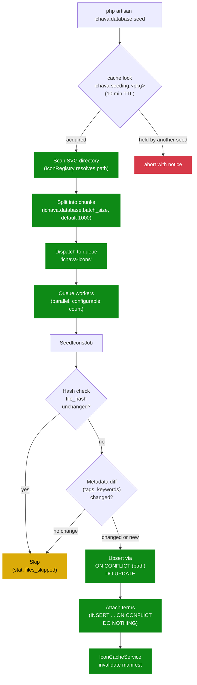

[← Docs](../README.md)

# Database Seeding

*How-to guide.*

Ichava stores icons in the database for fast searching and filtering. The seeding system uses parallel processing with multi-level deduplication for efficient handling of large icon sets.

### Recommended Setup

```bash
# 1. Run migrations
php artisan migrate

# 2. Seed icons (required - not automatic)
php artisan ichava:database seed

# Or combine with fresh migration
php artisan migrate:fresh --force
php artisan ichava:database seed
```

### How It Works

1. Icons are split into chunks (default: 1000 icons per job)
2. Each chunk becomes a separate queue job
3. Multiple queue workers process jobs in parallel
4. **Multi-level deduplication** prevents duplicate entries
5. **Smart change detection** only updates modified icons



### Multi-Level Deduplication

Ichava implements deduplication at multiple levels to ensure data integrity:

| Level | Protection | When Applied |
|-------|------------|--------------|
| **1. Database** | `UNIQUE` constraint on `path` | On INSERT/UPDATE |
| **2. Hash-based** | Skip files with unchanged `file_hash` | Before processing |
| **3. Metadata** | Compare `tags` and `keywords` arrays | Before processing |
| **4. Upsert** | `ON CONFLICT` update instead of insert | During batch insert |
| **5. Categories** | `INSERT ... ON CONFLICT DO NOTHING` | When attaching terms |
| **6. Auto-seed** | Check if package has icons before seeding | On package registration |
| **7. Cache Lock** | Prevent concurrent seeding for same package | During seeding |

### Change Detection

Icons are only updated when changes are detected:

| Detection | What Changes | Action |
|-----------|--------------|--------|
| New file (not in DB) | N/A | INSERT |
| `file_hash` differs | SVG content changed | UPDATE |
| `tags` differ | Tag extraction logic changed | UPDATE |
| `keywords` differ | Keyword extraction changed | UPDATE |
| All same | Nothing changed | SKIP |
| `--update` flag | Force mode | UPDATE ALL |

### Quick Commands

```bash
# Seed all packages (uses queue by default)
php artisan ichava:database seed

# Seed synchronously (no queue, for testing)
php artisan ichava:database seed --sync

# Seed specific package
php artisan ichava:database seed --package=vendor/your-icons

# Force update ALL icons (even unchanged)
php artisan ichava:database seed --update

# Combine flags
php artisan ichava:database seed --sync --update

# Fresh start (drop tables + re-seed)
php artisan ichava:database refresh --force

# Check statistics
php artisan ichava:database stats
```

### Seeding Statistics

Each seeding job tracks detailed statistics:

| Stat | Description |
|------|-------------|
| `files_received` | Total files in chunk |
| `files_processed` | Files actually inserted/updated |
| `files_skipped` | Unchanged files (optimization) |
| `files_new` | New icons added |
| `files_updated` | Existing icons updated |

### Starting Queue Workers

```bash
# Single worker
php artisan queue:work --queue=ichava-icons --memory=512 --timeout=300

# Multiple workers (recommended for large sets)
php artisan queue:work --queue=ichava-icons --memory=512 --timeout=300 &
php artisan queue:work --queue=ichava-icons --memory=512 --timeout=300 &
php artisan queue:work --queue=ichava-icons --memory=512 --timeout=300 &

# Or use Laravel Horizon (recommended)
php artisan horizon
```

### Monitor Progress

```bash
# Via Artisan
php artisan ichava:job-status

# Via Horizon Dashboard
https://example.com/horizon
```

### Configuration

```php
// config/ichava.php
'database' => [
    'batch_size' => env('ICHAVA_BATCH_SIZE', 1000),  // Icons per job
    'use_queue' => true,                              // Enable queue mode
    'auto_seed' => false,                             // Disabled by default
],

'queue' => [
    'name' => 'ichava-icons',                         // Queue name
    'horizon' => [
        'maxProcesses' => 25,                         // Max parallel workers
        'memory' => 256,                              // Memory per worker (MB)
        'timeout' => 600,                             // Job timeout (seconds)
    ],
],
```

### Performance Example

| Package | Icons | Jobs | Workers | Time |
|---------|-------|------|---------|------|
| vendor/your-icons | 121,000+ | 122 | 5 | ~3 min |
| vendor/your-icons | 5,000+ | 5 | 3 | ~30 sec |
| vendor/your-icons | 1,500+ | 2 | 1 | ~10 sec |

### Auto-Seeding (Disabled by Default)

Auto-seeding on package registration is **disabled by default**. This prevents:
- Unexpected seeding during HTTP requests
- Duplicate seeding across multiple requests
- Performance issues during application boot

**Recommended approach - use explicit seeding commands:**

```bash
php artisan ichava:database seed           # Recommended
php artisan migrate:fresh --seed           # With migrations
```

**Auto-seeding safeguards (when enabled):**
- ✅ Only runs if `auto_seed = true` in config
- ✅ Only runs if package has **ZERO** icons in database
- ✅ Only runs if no seeding is already in progress (cache lock)
- ✅ Skips during migration/seeding commands (use explicit commands)

To enable auto-seeding (not recommended for production):

```php
// config/ichava.php
'database' => [
    'auto_seed' => true,  // Enable auto-seeding
],
```

### Programmatic API

Use `IchavaSeeder` directly in your code:

```php
use Simtabi\Laranail\Ichava\Support\Seeder\IchavaSeeder;

$seeder = app(IchavaSeeder::class);

// Seed a complete package (terms + icons) - RECOMMENDED
$result = $seeder->seedPackage('vendor/your-icons', '/path/to/svg');
// Returns: ['package', 'terms', 'icons', 'batch_id', 'processed', 'error', 'force']

// Force update all icons (even unchanged)
$result = $seeder->seedPackage('vendor/your-icons', '/path/to/svg', true, 1000, true);
// Last parameter: force = true

// Seed icons only (to queue)
$batch = $seeder->seed('vendor/your-icons', '/path/to/svg');
echo "Batch ID: {$batch->id}";

// Seed icons only (synchronously)
$result = $seeder->seedSync('vendor/your-icons', '/path/to/svg');
echo "Processed: {$result['processed']} icons";

// Force update synchronously
$result = $seeder->seedSync('vendor/your-icons', '/path/to/svg', 1000, true);
// Last parameter: force = true

// Check job status
$status = $seeder->getStatus($batchId);

// Cancel running seeding
$seeder->cancel($batchId);

// Set modes before running
$seeder->setSyncMode(true);      // Force synchronous
$seeder->setForceUpdate(true);   // Force update all
$seeder->run();
```

---

← Previous: [Global Helper Function](global-helper.md) · [Back to README](../README.md) · Next: [API Endpoints](../browser/api-endpoints.md) →
