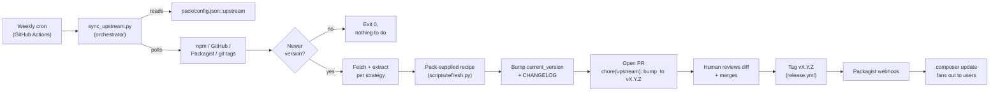

[← Documentation index](README.md)

# Icon-pack maintainer sync

*How we (the package maintainers) keep vendored SVG assets in step
with the upstream sources we mirror.*

This is the **maintainer-side** counterpart to
[`icon-pack-upstream-tracking.md`](icon-pack-upstream-tracking.md).
The tracker tells host apps "this pack is N versions behind." This
document explains how *we* close that gap and ship a new release.

## Why a separate workflow

End users install our packs into `vendor/`. Composer regenerates that
directory on every install, so any changes a user makes there are
discarded the next time they `composer install`. **Only the package
maintainer can persist asset refreshes**, by:

1. Refreshing the bundled SVGs in the package repo.
2. Tagging a new release.
3. Letting Packagist + `composer update` fan the change out.

So every refresh is a maintainer-side commit, not a runtime command.
The legacy `ichava:update*` Artisan commands shipped in core 1.0.x
have been removed in 1.1.0; they ran in the host app where they
couldn't persist. The new model runs in the pack repo's CI.

## Pipeline (cron → PR → tag → fan-out)

Three patterns from established ecosystems shape the design (see the
research notes inline in commit `feat(scripts): sync orchestrator`):

| Pattern | Borrowed from | Why |
|---|---|---|
| Cron-driven, batched-per-pack refresh | `@iconify/json` | Same upstream-fan-in problem at much larger scale; pattern proven across 100+ icon sets. |
| Human-gated PR, then tag-triggered release | `tailwindlabs/heroicons` | Composer ecosystem; we don't want auto-tags pushing untested asset diffs to thousands of installs. |
| Idempotent "if tag exists, skip" guard | `tabler/tabler-icons` | Cron firing twice on the same upstream version must be a no-op. |

## Components

### 1. The toolkit (`ichava/maintainer-toolkit`)

A standalone Docker-first Python package, one per ecosystem. It:

- Reads each pack's config from its own `config/<slug>.json`
  (registry: `config/packs.json`).
- Polls each upstream's `version_check_url` (npm / GitHub / Packagist
  / URL) via `ichava_maintainer_toolkit.core.checker`.
- Compares against the recorded `current_version`. If equal, exits 0
  with no commits.
- If newer, runs the matching recipe (composed `Pipeline` of one
  Source + zero-or-more Transforms + one-or-more Sinks). See the
  fluent API in the toolkit's `README.md`.
- Bumps `current_version` in the toolkit's `config/<slug>.json`,
  prepends a `CHANGELOG.md` entry on the pack repo, commits to a
  branch, pushes, and opens a PR via `gh pr create`.

Strategies recognised (the source's `type`):

| `type` | What it does | Used by |
|---|---|---|
| `npm` | `npm pack {package}@{version}` then extract `package/{source_path}/*.svg` via the `NpmTarball` source | flag-icons, tabler-icons |
| `github-archive` | Downloads `{archive_url}` (interpolated), extracts the matching subdir via the `GithubArchive` source | OpenMoji (within the emoji-sets recipe) |
| `github-release` / `github-tag` | Same but resolves the version through the releases/tags API | (any pack without an npm mirror) |
| `recipe` | Hand off to a named recipe under `ichava_maintainer_toolkit.recipes/` -- used when a pack composes multiple sources / custom taxonomies (emoji-sets blends Twemoji + OpenMoji + Unicode CLDR) | emoji-sets |
| `url` | Custom JSON endpoint; `source.version_field` is a dot-path | escape hatch for non-registry vendors |

### 2. Per-pack recipes (in the toolkit, not the pack)

Most packs don't need a custom recipe -- the `simple_npm` recipe in
the toolkit handles the `source.type=npm + source_path=...` case. Packs
that mix sources (emoji-sets) get a dedicated module under
`src/ichava_maintainer_toolkit/recipes/<slug>.py` and are dispatched by
the CLI when `cfg.name` matches.

### 3. Workflow template

A drop-in `.github/workflows/sync-upstream.yml` each pack ships. It
checks out the toolkit repo, runs the toolkit's Docker image, and
opens a PR when upstream has moved. The canonical template lives in
the toolkit at `templates/sync-upstream.yml` (search the
`maintainer-toolkit` repo for the latest). Cron fires on Mondays 06:45
UTC; the 45-past-the-hour offset is borrowed from Homebrew's autobump
cron to dodge the on-the-hour GitHub Actions load spike.

### 4. Notification path

End users learn about new versions via `composer outdated`. We do not
add user-facing alerts beyond:

- The `IconPackUpdateAvailable` Laravel event (informational; the
  host app subscribes if it wants a Slack / email / dashboard signal).
- The `php artisan ichava:icons:check-updates` CLI (informational
  same).

Composer + Packagist already handles the "your dependency has a new
version" case well — duplicating that with maintainer-side webhooks
would be scope creep without user demand.

## End-user vs maintainer cheat sheet

| Concern | End user does | Maintainer does |
|---|---|---|
| Discover that pack X is behind | `php artisan ichava:icons:check-updates` (informational only) | (irrelevant -- maintainer's CI does it automatically) |
| Pull in new SVGs | `composer update ichava/<pack>` after we've tagged | Cron + sync orchestrator + PR + tag |
| Subscribe to update events | `Listener` for `IconPackUpdateAvailable` in `EventServiceProvider` | n/a |
| Override an icon locally | Drop a custom SVG in the host app's storage path; configure resolver | n/a |
| Pin to an old version | `composer require ichava/<pack>:1.2.3` | n/a |
| Refresh assets | (cannot -- vendor/ is regenerated) | Run sync orchestrator manually with `--force` if needed |

## Failure modes

| Failure | Behaviour |
|---|---|
| Upstream unreachable (network, 5xx) | Orchestrator exits 0 with a `WARN` log line; cron retries next week. No PR opened. |
| Upstream version unparseable | Same as above. |
| Recipe script returns non-zero | Orchestrator commits nothing, exits non-zero, CI run fails red, GitHub Actions notifies the maintainer. |
| Refreshed assets fail downstream tests on the PR | The PR sits unmerged; maintainer fixes the recipe and re-runs `workflow_dispatch`. |
| `gh pr create` rejected (already exists) | Orchestrator detects the existing PR and skips. Idempotent. |

## See also

- [`icon-pack-upstream-tracking.md`](icon-pack-upstream-tracking.md) -- the host-app side of the story
- [`architecture.md`](architecture.md) -- where this slots into the package topology
- [`security-model.md`](security-model.md) -- HTTP timeouts + cache poisoning considerations on the version-check endpoints
