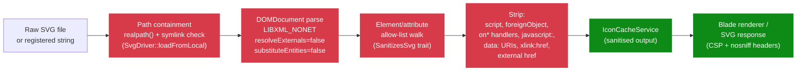
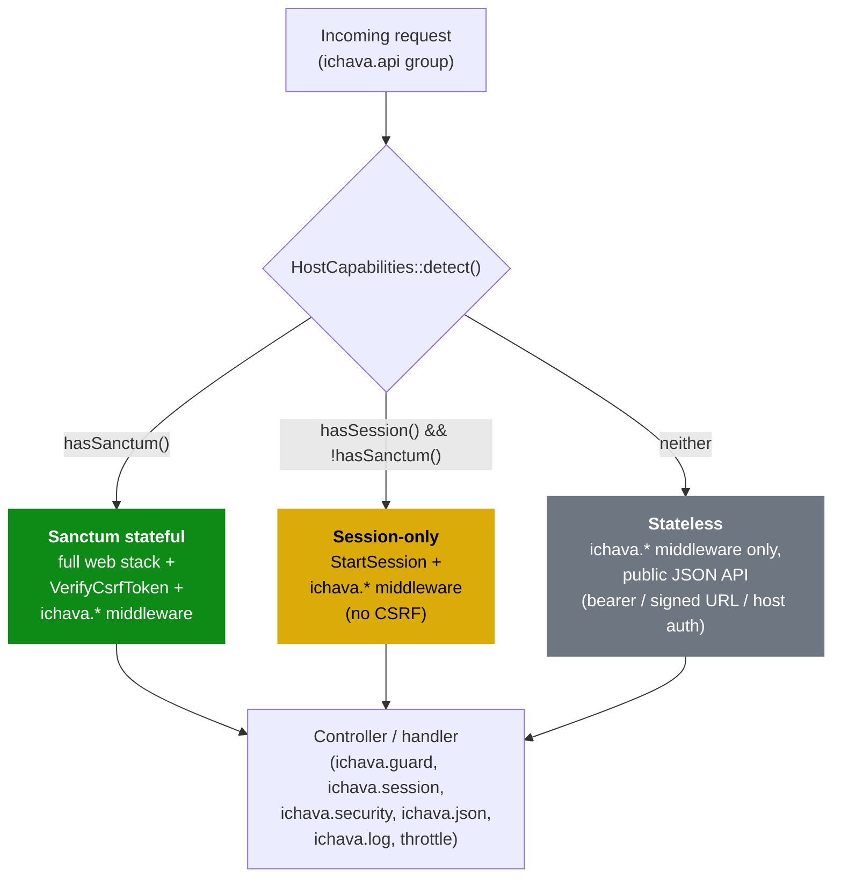

[← Documentation index](README.md)

# Security model

*Explanation.*

For vulnerability disclosure, see [SECURITY.md](SECURITY.md). For a full STRIDE walkthrough, configurable hardening modes, and audit-pipeline contract, see [security-threat-model.md](security-threat-model.md). This page covers the built-in protections an installer inherits without changing any configuration.

## Built-in protections

**SVG sanitisation** (`SanitizesSvg` trait). DOM-based allow-list parse with `LIBXML_NONET` and `resolveExternals=false` (XXE-safe). Blocks `javascript:`, `data:text/javascript`, `data:image/svg+xml`, `vbscript:`, `file:`, `href`, `xlink:href`, and every `on*` event handler.

**SVG response hardening.** `GET /icons/{id}/svg` is served with `X-Content-Type-Options: nosniff`, a strict `Content-Security-Policy: default-src 'none'; style-src 'unsafe-inline'; sandbox`, and `Content-Disposition: inline; filename=…` so a sanitiser miss cannot escalate to script execution when the URL is opened directly.

**Path safety** (`SvgDriver::loadFromLocal`). `realpath()` containment plus symlink rejection prevent directory escape.

**Mass-assignment.** `Icon` and `IconTerm` models declare explicit `$fillable` allow-lists. No model uses `Model::unguard()`.

**Rate limiting.** The `ichava.api` middleware group carries a global throttle floor (`ichava-browser.rate_limiting.api_floor`, default 300 req/min) on top of per-endpoint `throttle:N,1` limits (60–300 req/min).

**Security headers** (`IchavaApiSecurity` middleware): `X-Content-Type-Options: nosniff`, `X-Frame-Options: DENY`, `Content-Security-Policy: default-src 'none'; frame-ancestors 'none'`, `Strict-Transport-Security: max-age=31536000; includeSubDomains`, `Permissions-Policy: camera=(), microphone=(), geolocation=(), payment=(), usb=()`, plus a sensible `Referrer-Policy`.

**CORS.** Defaults to `config('app.url')`, no wildcard. Override via `ichava-browser.api.cors.allowed_origins`.

**Audit pipeline.** Every middleware reject (SQL/XSS/path-traversal pattern, oversize body, bad content type) is recorded by `AuditLogger` on the `ichava-audit` log channel (90-day retention, mode 0640) and dispatched as a `SecurityAuditEvent` for SIEM forwarding. See [security-threat-model.md](security-threat-model.md#audit-pipeline) for the full event catalogue.

**CSP nonce / hash modes.** `ichava-browser.security.csp.mode` accepts `strict` (default, JSON-API safe), `nonce` (request-scoped 192-bit nonce, paired with the `@ichava_csp_nonce` Blade directive), or `hash` (pre-computed `sha256` digest list). The browser SPA should run under `nonce`; stateless deployments stay on `strict`.

**Subresource Integrity.** Use `<x-ichava::sri-asset src="…" />` to emit `<script integrity="sha384-…" crossorigin="anonymous">`. Hashes can come from a manifest at `ichava-browser.security.sri.manifest` or be computed at render time from the public-path file.

## Hybrid API stack

The `ichava.api` group adapts to whatever the host application provides. `HostCapabilities` detects it at boot:

| Mode | Detection | Stack |
|---|---|---|
| Sanctum stateful | `hasSanctum()` returns true | `web` + `ichava.*` middleware (CSRF enforced via `VerifyCsrfToken`) |
| Session-only | Sessions available, no Sanctum | `StartSession` + `ichava.*` middleware (no CSRF, stateless API expectation) |
| Stateless | No session support | `ichava.*` middleware only, treat as a public JSON API; clients should send `Accept: application/json` |

If your host app enforces CSRF globally, the Sanctum stateful mode engages automatically. Otherwise the package falls back to the minimal stack and expects bearer tokens, signed URLs, or host-level auth.

## Headless installs

When you install only `ichava/core` (no `ichava/browser`), there is no HTTP surface at all: no routes, no middleware, no controllers. The protections above only matter when `ichava/browser` is present. Headless deployments inherit one thing: the SVG sanitiser, which the Blade renderer always runs before output.

## Reporting

Vulnerabilities go privately to `security@simtabi.com`. Do not open public GitHub issues for security problems.

## See also

- [Architecture](architecture.md)
- [Security threat model](security-threat-model.md), STRIDE walkthrough and disclosure SLAs
- [Browser configuration](browser/configuration.md), CORS and rate-limit knobs
- [Browser API endpoints](browser/api-endpoints.md)
