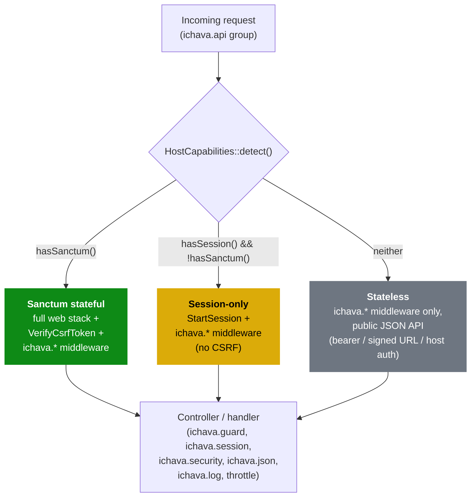

[← Documentation index](README.md)

# Security model

*Explanation.*

For vulnerability disclosure, see [SECURITY.md](SECURITY.md). For a full STRIDE walkthrough, configurable hardening modes, and audit-pipeline contract, see [security-threat-model.md](security-threat-model.md). This page covers the built-in protections an installer inherits without changing any configuration.

## Built-in protections

**SVG sanitisation** (`SanitizesSvg` trait). DOM-based allow-list parse with `LIBXML_NONET`,
`resolveExternals=false` and `substituteEntities=false` (XXE-safe).

The policy blocks **by value, not by name**. A blunt ban on an attribute over-blocks legitimate
content and still misses the real attack, so each construct is judged on what it points at:

| Construct | Rule |
|---|---|
| `href`, `xlink:href` | same-document fragments only, `^#[A-Za-z_][\w.:-]*$`. An external, protocol-relative, relative, `data:`, `blob:` or `javascript:` target is removed. This is what lets `<use>` sprites work at all. |
| `style` value | kept: it is the only paint source for thousands of icons, but any `url()` must target a fragment, and `behavior:` / `-moz-binding` are refused outright. |
| Dangerous protocols | matched **anywhere** in a value, not just at its start, and matched again with whitespace and control characters collapsed, so `url(java\nscript:…)` is not a bypass. |
| `role`, `aria-*` | allowed by shape (`/^aria-[a-z]+$/`). ARIA is inert, and an icon shipping `<title>`/`<desc>` needs `aria-labelledby` to point at them. |
| `script`, `foreignObject`, `iframe`, `object`, `embed`, SMIL | always removed, no value exception. |
| `on*` handlers, `formaction` | always removed. |

Element and attribute names are matched **case-insensitively**, and an attribute is removed under
its real name. Both matter: the allow-lists are authored in SVG's own casing, so `clipPath` and
`linearGradient` would otherwise be unmatchable and stripped from every icon.

**Two passes run before sanitisation**, inside the same cache, in `Icon::svg_content`:

- **Per-file id namespacing.** SVG ids are page-scoped in practice. Two icons that both define
  `id="Layer_1"` make the second one's `url(#Layer_1)` resolve to the first one's definition,
  silently wrong, and the browser renders 60+ icons at once. Every id is prefixed with
  `'i' + sha1(path)[0:6] + '-'`, and every reference moves with it: `href`, `url()` in attributes
  and in `<style>`, `aria-labelledby`, `aria-describedby`.
- **Root sizing normalisation.** `width`/`height` are dropped when a `viewBox` is present, so the
  component controls the size; a `viewBox` is synthesised when only dimensions exist. Only the root
  element is touched.

**Malformed input is recovered, not rejected.** An icon author is not a compiler, and a rejection
reaches the consumer as a blank icon. A strict parse is tried first, then a recovery parse, plus
two text repairs: HTML named entities become the numeric form XML defines, and an ampersand that
opens no valid reference is escaped. **Recovery is about syntax only**, the security flags are
identical across both passes and the allow-list runs over whatever comes back, so a malformed
document is not a route past it.

```mermaid
flowchart LR
    raw["Raw SVG file<br/>or registered string"]
    path["Path containment<br/>realpath() + symlink check<br/>(SvgDriver::loadFromLocal)"]
    parse["Parse<br/>strict, then recover<br/>LIBXML_NONET<br/>no external entities"]
    ids["Namespace ids<br/>per file<br/>(NamespacesSvgIds)"]
    size["Normalise root sizing<br/>(NormalisesSvgSizing)"]
    allow["Element/attribute<br/>allow-list walk<br/>(SanitizesSvg)"]
    strip["Block by value:<br/>non-fragment href,<br/>off-document url(),<br/>script, foreignObject,<br/>on* handlers, protocols"]
    cache["IconCacheService<br/>(post-sanitisation)"]
    blade["Blade renderer /<br/>SVG response<br/>(CSP + nosniff headers)"]

    raw --> path --> parse --> ids --> size --> allow --> strip --> cache --> blade

    classDef boundary fill:#d73a49,stroke:#d73a49,color:#fff
    classDef safe fill:#0e8a16,stroke:#0e8a16,color:#fff
    class path,parse,allow,strip boundary
    class ids,size,cache,blade safe
```

**Known-degraded by policy.** Five `metronic-icons` brand logos wrap a base64 PNG in `<pattern>` +
`<image>`. Both stay blocked, so those five render empty. They are bitmaps in an SVG wrapper, not
icons.

**SVG response hardening.** `GET /icons/{id}/svg` is served with `X-Content-Type-Options: nosniff`, a strict `Content-Security-Policy: default-src 'none'; style-src 'unsafe-inline'; sandbox`, and `Content-Disposition: inline; filename=…` so a sanitiser miss cannot escalate to script execution when the URL is opened directly.

**Path safety** (`SvgDriver::loadFromLocal`). `realpath()` containment plus symlink rejection prevent directory escape.

**Mass-assignment.** `Icon` and `IconTerm` models declare explicit `$fillable` allow-lists. No model uses `Model::unguard()`.

**Rate limiting.** The `ichava.api` middleware group carries a global throttle floor (`ichava.browser.rate_limiting.api_floor`, default 300 req/min) on top of per-endpoint `throttle:N,1` limits (60–300 req/min).

**Security headers** (`IchavaApiSecurity` middleware): `X-Content-Type-Options: nosniff`, `X-Frame-Options: DENY`, `Content-Security-Policy: default-src 'none'; frame-ancestors 'none'`, `Strict-Transport-Security: max-age=31536000; includeSubDomains`, `Permissions-Policy: camera=(), microphone=(), geolocation=(), payment=(), usb=()`, plus a sensible `Referrer-Policy`.

**CORS.** Defaults to `config('app.url')`, no wildcard. Override via `ichava.browser.api.cors.allowed_origins`.

**Audit pipeline.** Every middleware reject (SQL/XSS/path-traversal pattern, oversize body, bad content type) is recorded by `AuditLogger` on the `ichava-audit` log channel (90-day retention, mode 0640) and dispatched as a `SecurityAuditEvent` for SIEM forwarding. See [security-threat-model.md](security-threat-model.md#audit-pipeline) for the full event catalogue.

**CSP nonce / hash modes.** `ichava.browser.security.csp.mode` accepts `strict` (default, JSON-API safe), `nonce` (request-scoped 192-bit nonce, paired with the `@ichava_csp_nonce` Blade directive), or `hash` (pre-computed `sha256` digest list). The browser SPA should run under `nonce`; stateless deployments stay on `strict`.

**Subresource Integrity.** Use `<x-ichava:sri-asset src="…" />` to emit `<script integrity="sha384-…" crossorigin="anonymous">`. Hashes can come from a manifest at `ichava.browser.security.sri.manifest` or be computed at render time from the public-path file.

## Hybrid API stack

The `ichava.api` group adapts to whatever the host application provides. `HostCapabilities` detects it at boot:

```mermaid
flowchart TD
    req["Incoming request<br/>(ichava.api group)"]
    detect{"HostCapabilities::detect()"}
    sanctum["<b>Sanctum stateful</b><br/>full web stack +<br/>VerifyCsrfToken +<br/>ichava.* middleware"]
    session["<b>Session-only</b><br/>StartSession +<br/>ichava.* middleware<br/>(no CSRF)"]
    stateless["<b>Stateless</b><br/>ichava.* middleware only,<br/>public JSON API<br/>(bearer / signed URL / host auth)"]
    handler["Controller / handler<br/>(ichava.guard, ichava.session,<br/>ichava.security, ichava.json,<br/>ichava.log, throttle)"]

    req --> detect
    detect -- "hasSanctum()" --> sanctum
    detect -- "hasSession() && !hasSanctum()" --> session
    detect -- "neither" --> stateless
    sanctum --> handler
    session --> handler
    stateless --> handler

    classDef strict fill:#0e8a16,stroke:#0e8a16,color:#fff
    classDef relaxed fill:#dbab09,stroke:#dbab09,color:#000
    classDef minimal fill:#6e7681,stroke:#6e7681,color:#fff
    class sanctum strict
    class session relaxed
    class stateless minimal
```

| Mode | Detection | Stack |
|---|---|---|
| Sanctum stateful | `hasSanctum()` returns true | `web` + `ichava.*` middleware (CSRF enforced via `VerifyCsrfToken`) |
| Session-only | Sessions available, no Sanctum | `StartSession` + `ichava.*` middleware (no CSRF, stateless API expectation) |
| Stateless | No session support | `ichava.*` middleware only, treat as a public JSON API; clients should send `Accept: application/json` |

If your host app enforces CSRF globally, the Sanctum stateful mode engages automatically. Otherwise the package falls back to the minimal stack and expects bearer tokens, signed URLs, or host-level auth.

## Headless installs

When you install only `ichava/core` (no `ichava/browser`), there is no HTTP surface at all: no routes, no middleware, no controllers. The protections above only matter when `ichava/browser` is present. Headless deployments inherit one thing: the SVG sanitiser, which the Blade renderer always runs before output.

## Reporting

Vulnerabilities go privately to `security@simtabi.com`. Do not open public GitHub issues for security problems.

## See also

- [Architecture](architecture.md)
- [Security threat model](security-threat-model.md), STRIDE walkthrough and disclosure SLAs
- [Browser configuration](browser/configuration.md), CORS and rate-limit knobs
- [Browser API endpoints](browser/api-endpoints.md)
