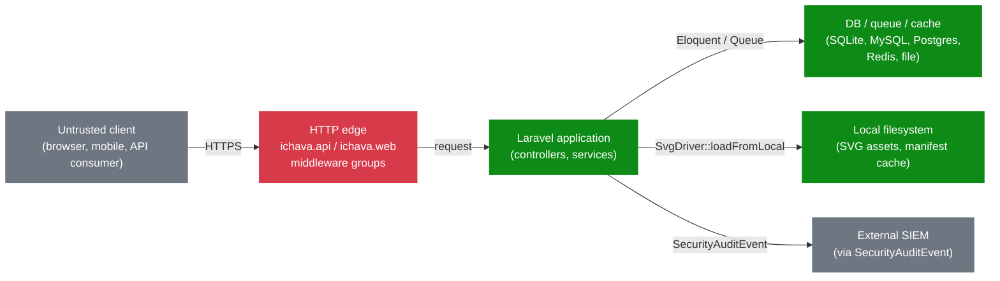
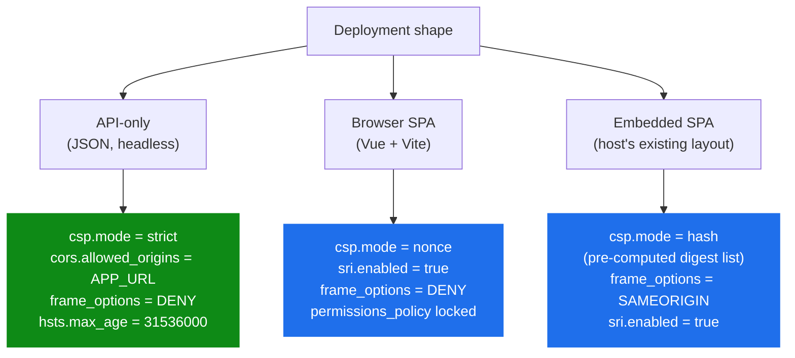

[← Documentation index](README.md)

# Security threat model

*Explanation.*

Canonical threat model for the Ichava ecosystem. STRIDE walkthrough, mapped mitigations, disclosure SLAs, and the contract between core and the browser package.

## Trust boundaries

The HTTP edge is the only place untrusted bytes cross. Everything past `IchavaApiSecurity` is treated as trusted (post-validation). SVGs from disk are *also* untrusted: a registered icon path can be smuggled by a misconfigured packagist dependency, so the sanitiser runs before any DOM bytes hit the response.

## STRIDE walkthrough

| Threat | Vector | Mitigation | Owner |
|---|---|---|---|
| **Spoofing** | Stolen session, replayed bearer token | `HostCapabilities` engages full `web` stack with `VerifyCsrfToken` when Sanctum is present; otherwise the API expects bearer / signed-URL auth from the host | `ichava/browser` |
| **Spoofing** | Forged origin in CORS preflight | CORS defaults to `config('app.url')`, never `*`. Override is opt-in via `ICHAVA_API_CORS_ORIGINS` | `ichava/browser` |
| **Tampering** | Malicious SVG smuggled through a registered icon directory | `SanitizesSvg` trait: DOM allow-list parse with `LIBXML_NONET`, `resolveExternals=false`, `substituteEntities=false`. Strips `script`, `foreignObject`, `on*`, `javascript:`, `data:` URIs, `xlink:href`, external `href` | `ichava/core` |
| **Tampering** | Path traversal via icon identifier | `SvgDriver::loadFromLocal` does `realpath()` containment plus symlink rejection; the `ichava-browser` middleware also pattern-rejects `..`, `..%2e`, `....` in URLs and inputs | `ichava/core` + `ichava/browser` |
| **Tampering** | Drive-by replacement of published SPA assets | `SriAsset` Blade component emits Subresource Integrity hashes (default `sha384`); browsers refuse to execute mismatched bytes | `ichava/browser` |
| **Repudiation** | Operator denies running a destructive command | `AuditLogger` channel `ichava-audit` (90-day retention, mode 0640) records every command and middleware reject; SIEM receives a parallel `SecurityAuditEvent` | `ichava/core` |
| **Information disclosure** | XXE in SVG | `LIBXML_NONET` plus `resolveExternals=false` plus `substituteEntities=false`; explicit reject of `<!ENTITY` constructs | `ichava/core` |
| **Information disclosure** | Verbose stack traces leaked from API | All API errors flow through `IchavaApiSecurity::errorResponse()` which returns a fixed JSON shape with no internal detail | `ichava/browser` |
| **Information disclosure** | Sensitive query params logged in plain text | Audit pipeline whitelists context fields; raw query strings are never serialised | `ichava/core` |
| **Denial of service** | Large request body | `ichava-browser.max_request_size` (default 1 MiB) hard cap | `ichava/browser` |
| **Denial of service** | Unbounded request rate | Per-route `throttle:N,1` plus the `ichava.api` group floor (`api_floor`, default 300 rpm) | `ichava/browser` |
| **Denial of service** | Concurrent re-seed flooding the queue | `cache()->lock('ichava:seeding:<pkg>', 600)` on every seed dispatch | `ichava/core` |
| **Elevation of privilege** | Stored XSS via icon name | `IconComponent` escapes the rendered name; sanitiser strips event handlers; CSP `nonce`/`hash` mode (opt-in) blocks any inline script the sanitiser misses | `ichava/core` + `ichava/browser` |
| **Elevation of privilege** | Mass-assignment | `Icon` and `IconTerm` declare explicit `$fillable`; no model uses `Model::unguard()` | `ichava/core` |

## Configurable hardening

Knobs live under `ichava-browser.security.*`:

| Key | Modes | Default |
|---|---|---|
| `csp.mode` | `strict`, `nonce`, `hash` | `strict` |
| `csp.report_uri` | URL string, optional | `null` |
| `csp.report_only` | bool | `false` |
| `csp.extra_directives` | merged into the directive set | `[]` |
| `csp.hashes` | per-directive hash list (used in `hash` mode) | `[]` |
| `hsts.enabled` | bool | `true` |
| `hsts.max_age` | seconds | `31536000` |
| `hsts.include_subdomains` | bool | `true` |
| `hsts.preload` | bool | `false` |
| `frame_options` | `DENY`, `SAMEORIGIN` | `DENY` |
| `referrer_policy` | any RFC value | `strict-origin-when-cross-origin` |
| `permissions_policy` | feature list | `camera=(), microphone=(), geolocation=(), payment=(), usb=()` |
| `sri.enabled` | bool | `true` |
| `sri.algorithm` | `sha256`, `sha384`, `sha512` | `sha384` |
| `sri.manifest` | path to JSON map | `null` (compute on demand) |

The `@ichava_csp_nonce` Blade directive emits the request-scoped nonce attribute. Pair it with `csp.mode = 'nonce'` so the policy's `script-src` and `style-src` allow only inline content carrying the matching nonce.

## Audit pipeline

Every protection layer routes rejections through `Simtabi\Laranail\Ichava\Support\AuditLogger`:

| Event | Severity | Source |
|---|---|---|
| `http.invalid_content_type` | warning | `IchavaApiSecurity` |
| `http.request_too_large` | warning | `IchavaApiSecurity` |
| `http.sql_injection_attempt` | error | `IchavaApiSecurity` |
| `http.xss_attempt` | error | `IchavaApiSecurity` |
| `http.path_traversal_attempt` | error | `IchavaApiSecurity` |
| `svg.sanitiser_rejected` | error | `SanitizesSvg` (when wired by host) |
| `svg.path_outside_root` | error | `SvgDriver::loadFromLocal` (when wired by host) |
| `seeding.lock_held` | warning | `IchavaSeeder` (when wired by host) |
| `cache.invalidated` | info | `IconCacheService` (when wired by host) |

Each record:

1. Writes a structured line to the `ichava-audit` channel (90-day daily rotation, mode 0640).
2. Dispatches `Simtabi\Laranail\Ichava\Events\SecurityAuditEvent` so host applications can forward to a SIEM, alert on severity ≤ 3, or persist to a tamper-evident store.

Both sinks are independently toggleable via `ichava.security.audit.dispatch_event` and `ichava.security.audit.enabled` so headless deployments and SIEM-only deployments stay clean.

## Disclosure SLA

| Step | Window |
|---|---|
| Acknowledgement to reporter | within 48 hours |
| Triage and severity assignment | within 5 business days |
| Patch released for current `main` and most recent tagged minor | within 14 days for severity ≤ 3, 30 days for severity 4 |
| Public advisory + CVE filing (if assigned) | coordinated with reporter, default 90-day embargo |

Reports go to **security@simtabi.com** (PGP key fingerprint published on the Simtabi security page). Public GitHub issues are *not* an acceptable disclosure channel.

## Standards traceability

| Control | Standard reference |
|---|---|
| Input validation, output encoding | OWASP ASVS L2 V5 |
| Session management (Sanctum stateful mode) | ASVS L2 V3 |
| Cryptographic random for nonce (192 bits CSPRNG) | ASVS L2 V6, NIST SP 800-90A |
| HSTS, CSP, X-Frame-Options, Referrer-Policy, Permissions-Policy | Mozilla Web Security Guidelines (Modern profile) |
| SRI for published assets | W3C Subresource Integrity Recommendation |
| Audit log retention (90 days minimum) | ASVS L2 V7 |

## See also

- [Security model](security-model.md), the operator-facing knob list
- [Architecture](architecture.md), package boundaries and trust zones
- [Browser configuration](browser/configuration.md), the runnable knobs
- [SECURITY.md](SECURITY.md), the disclosure policy
